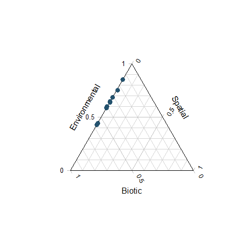
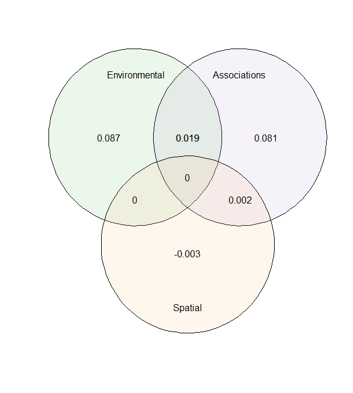

[](http://www.repostatus.org/#active)
[](https://www.gnu.org/licenses/gpl-3.0)


# s-jSDM - Fast and accurate Joint Species Distribution Modeling

## About the method

The method is described in the preprint Pichler & Hartig (2020) A new method for faster and more accurate inference of species associations from novel community data, https://arxiv.org/abs/2003.05331. The code for producing the results in this paper is available under the subfolder publications in this repo.

The method itself is wrapped into an R package, available under subfolder sjSDM. You can also use it stand-alone under Python (see instructions below). Note: for both the R and the python package, python >= 3.6 and pytorch must be installed (more details below).

## Installing the R / Python package

### R-package

Install the package via


```r
devtools::install_github("https://github.com/TheoreticalEcology/s-jSDM", subdir = "sjSDM")
```

Depencies for the package can be installed before or after installing the package. Detailed explanations of the dependencies are provided in vignette("Dependencies", package = "sjSDM"), source code [here](https://github.com/TheoreticalEcology/s-jSDM/blob/master/sjSDM/vignettes/Dependencies.Rmd). Very briefly, the dependencies can be automatically installed from within R:


```r
sjSDM::install_sjSDM(version = "gpu") # or
sjSDM::install_sjSDM(version = "cpu")
```
Once the dependencies are installed, the following code should run:

Simulate a community and fit model:

```r
library(sjSDM)
set.seed(42)
community <- simulate_SDM(sites = 100, species = 10, env = 3)
Env <- community$env_weights
Occ <- community$response
SP <- matrix(rnorm(200, 0, 0.3), 100, 2) # spatial coordinates (no effect on species occurences)

model <- sjSDM(Y = Occ, env = linear(data = Env, formula = ~X1+X2+X3), spatial = linear(data = SP, formula = ~0+X1:X2), se = TRUE, family=binomial("probit"), sampling = 100L)
summary(model)
```

```
## LogLik:  -504.6354 
## Deviance:  1009.271 
## 
## Regularization loss:  0 
## 
## Species-species correlation matrix: 
## 
## 	sp1	 1.0000									
## 	sp2	 0.6060	 1.0000								
## 	sp3	 0.5690	 0.5340	 1.0000							
## 	sp4	-0.2610	-0.4220	-0.3920	 1.0000						
## 	sp5	 0.3300	 0.4110	 0.2350	-0.3370	 1.0000					
## 	sp6	 0.3520	 0.2920	 0.4660	-0.2750	 0.3280	 1.0000				
## 	sp7	 0.1000	-0.0260	 0.3910	-0.1880	 0.1060	 0.4440	 1.0000			
## 	sp8	 0.0590	 0.0530	-0.1790	 0.1930	-0.1990	-0.3290	-0.4630	 1.0000		
## 	sp9	-0.3410	-0.0070	-0.0370	-0.1910	 0.0290	-0.0070	 0.0550	-0.1820	 1.0000	
## 	sp10	 0.3240	 0.3750	 0.5180	-0.2720	 0.0690	 0.2920	 0.2530	-0.0980	 0.0840	 1.0000
## 
## 
## 
## Spatial: 
##              sp1        sp2        sp3       sp4       sp5       sp6
## X1:X2 0.01624047 -0.2450984 -0.3962334 0.1109433 0.2374157 0.3039845
##             sp7       sp8        sp9      sp10
## X1:X2 0.3846166 0.1161842 -0.7173341 0.1217704
## 
## 
## 
##                  Estimate  Std.Err Z value Pr(>|z|)    
## sp1 (Intercept)  -0.18574  0.24555   -0.76  0.44938    
## sp1 X1            0.71046  0.44964    1.58  0.11410    
## sp1 X2            1.26330  0.42911    2.94  0.00324 ** 
## sp1 X3            0.89589  0.42251    2.12  0.03397 *  
## sp2 (Intercept)  -0.42680  0.22058   -1.93  0.05300 .  
## sp2 X1            0.94477  0.40572    2.33  0.01988 *  
## sp2 X2            0.74882  0.38981    1.92  0.05473 .  
## sp2 X3           -0.68021  0.38152   -1.78  0.07460 .  
## sp3 (Intercept)  -0.12961  0.21079   -0.61  0.53864    
## sp3 X1           -0.73438  0.39270   -1.87  0.06148 .  
## sp3 X2           -0.21436  0.36432   -0.59  0.55627    
## sp3 X3            1.08829  0.35646    3.05  0.00227 ** 
## sp4 (Intercept)   0.32541  0.16838    1.93  0.05329 .  
## sp4 X1           -1.20363  0.32273   -3.73  0.00019 ***
## sp4 X2            0.55158  0.28821    1.91  0.05565 .  
## sp4 X3            0.38970  0.29440    1.32  0.18560    
## sp5 (Intercept)  -0.43205  0.19320   -2.24  0.02533 *  
## sp5 X1           -1.04277  0.35961   -2.90  0.00374 ** 
## sp5 X2           -0.69401  0.34017   -2.04  0.04133 *  
## sp5 X3            0.40542  0.32925    1.23  0.21819    
## sp6 (Intercept)   0.06749  0.17764    0.38  0.70400    
## sp6 X1            0.17106  0.33413    0.51  0.60868    
## sp6 X2            1.27985  0.31601    4.05  5.1e-05 ***
## sp6 X3            0.99158  0.32357    3.06  0.00218 ** 
## sp7 (Intercept)  -0.00384  0.19433   -0.02  0.98425    
## sp7 X1            0.61882  0.36442    1.70  0.08949 .  
## sp7 X2            0.55945  0.33860    1.65  0.09849 .  
## sp7 X3           -0.77952  0.34341   -2.27  0.02321 *  
## sp8 (Intercept)   0.20660  0.18006    1.15  0.25120    
## sp8 X1           -1.04961  0.34252   -3.06  0.00218 ** 
## sp8 X2            1.14112  0.31459    3.63  0.00029 ***
## sp8 X3            1.10545  0.32332    3.42  0.00063 ***
## sp9 (Intercept)  -0.08418  0.18224   -0.46  0.64413    
## sp9 X1           -0.53759  0.33667   -1.60  0.11031    
## sp9 X2           -0.81818  0.31794   -2.57  0.01007 *  
## sp9 X3           -0.72589  0.32441   -2.24  0.02525 *  
## sp10 (Intercept)  0.06430  0.16744    0.38  0.70095    
## sp10 X1          -1.38909  0.33459   -4.15  3.3e-05 ***
## sp10 X2          -0.41380  0.29047   -1.42  0.15428    
## sp10 X3          -0.58274  0.28570   -2.04  0.04138 *  
## ---
## Signif. codes:  0 '***' 0.001 '**' 0.01 '*' 0.05 '.' 0.1 ' ' 1
```

We also support also other response families:
Count data:

```r
model <- sjSDM(Y = Occ, env = linear(data = Env, formula = ~X1+X2+X3), spatial = linear(data = SP, formula = ~0+X1:X2), se = TRUE, family=poisson("log"))
```

Gaussian (normal):

```r
model <- sjSDM(Y = Occ, env = linear(data = Env, formula = ~X1+X2+X3), spatial = linear(data = SP, formula = ~0+X1:X2), se = TRUE, family=gaussian("identity"))
```


Let's have a look at the importance of the three groups (environment, associations, and space) on the occurences:

```r
imp = importance(model)
print(imp)
```

```
##    sp       env      spatial    biotic
## 1   1 0.5883792 1.837871e-06 0.4116189
## 2   2 0.4443856 5.633538e-04 0.5550511
## 3   3 0.4275645 1.353307e-03 0.5710822
## 4   4 0.5859118 1.120504e-04 0.4139762
## 5   5 0.5981846 8.074192e-04 0.4010080
## 6   6 0.6838074 7.415254e-04 0.3154511
## 7   7 0.6383056 2.764427e-03 0.3589299
## 8   8 0.8506847 9.044382e-05 0.1492248
## 9   9 0.7504049 8.914398e-03 0.2406807
## 10 10 0.6481720 1.420108e-04 0.3516860
```

```r
plot(imp)
```

<!-- -->


As expected, space has no effect on occurences.

Let's have a look on community level how the three groups contribute to the overall explained variance 

```r
an = anova(model)
print(an)
```

```
## Changes relative to empty model (without modules):
## 
##  Modules       LogLik            R2   marginal R2          R2ll
##        _  693.1472015  0.000000e+00  0.000000e+00  0.0000000000
##        A  -60.1042862  3.292327e-02  2.160879e-02  0.0867121530
##        B  -56.0340556  9.708102e-06  5.201053e-06  0.0808400517
##        S    2.3585205  2.531136e-04  1.577403e-04 -0.0034026257
##      A+B  -12.9833328 -3.809095e-03 -1.162539e-02  0.0187309893
##      A+S   -0.1002655  4.297665e-05  4.703826e-05  0.0001446525
##      B+S   -1.3592694 -1.723187e-04 -1.325275e-04  0.0019610112
##    A+B+S   -0.2504147 -8.926669e-05  4.547768e-05  0.0003612721
##     Full -128.4731038  2.915838e-02  1.010633e-02  0.1853475041
```

```r
plot(an)
```

<!-- -->

The anova shows the relative changes in the logLik of the groups and their intersections.


If it fails, check out the help of ?install_sjSDM, ?installation_help, and vignette("Dependencies", package = "sjSDM"). 

#### Installation workflow:
1. Try install_sjSDM()
2. New session, if no 'PyTorch not found' appears it should work, otherwise see ?installation_help
3. If do not get the pkg to run, create an issue [issue tracker](https://github.com/TheoreticalEcology/s-jSDM/issues) or write an email to maximilian.pichler at ur.de


### Python Package

```bash
pip install sjSDM_py
```
Python example


```python
import sjSDM_py as fa
import numpy as np
import torch
Env = np.random.randn(100, 5)
Occ = np.random.binomial(1, 0.5, [100, 10])

model = fa.Model_sjSDM(device=torch.device("cpu"), dtype=torch.float32)
model.add_env(5, 10)
model.build(5, optimizer=fa.optimizer_adamax(0.001),scheduler=False)
model.fit(Env, Occ, batch_size = 20, epochs = 100)
# print(model.weights)
# print(model.covariance)
```

```
## 
Iter: 0/100   0%|          | [00:00, ?it/s]
Iter: 0/100   0%|          | [00:00, ?it/s, loss=7.891]
Iter: 0/100   0%|          | [00:00, ?it/s, loss=7.856]
Iter: 0/100   0%|          | [00:00, ?it/s, loss=7.864]
Iter: 0/100   0%|          | [00:00, ?it/s, loss=7.824]
Iter: 0/100   0%|          | [00:00, ?it/s, loss=7.859]
Iter: 5/100   5%|5         | [00:00, 38.86it/s, loss=7.859]
Iter: 5/100   5%|5         | [00:00, 38.86it/s, loss=7.83] 
Iter: 5/100   5%|5         | [00:00, 38.86it/s, loss=7.78]
Iter: 5/100   5%|5         | [00:00, 38.86it/s, loss=7.777]
Iter: 5/100   5%|5         | [00:00, 38.86it/s, loss=7.795]
Iter: 9/100   9%|9         | [00:00, 39.00it/s, loss=7.795]
Iter: 9/100   9%|9         | [00:00, 39.00it/s, loss=7.79] 
Iter: 9/100   9%|9         | [00:00, 39.00it/s, loss=7.781]
Iter: 9/100   9%|9         | [00:00, 39.00it/s, loss=7.734]
Iter: 9/100   9%|9         | [00:00, 39.00it/s, loss=7.755]
Iter: 13/100  13%|#3        | [00:00, 38.31it/s, loss=7.755]
Iter: 13/100  13%|#3        | [00:00, 38.31it/s, loss=7.777]
Iter: 13/100  13%|#3        | [00:00, 38.31it/s, loss=7.684]
Iter: 13/100  13%|#3        | [00:00, 38.31it/s, loss=7.766]
Iter: 13/100  13%|#3        | [00:00, 38.31it/s, loss=7.705]
Iter: 17/100  17%|#7        | [00:00, 37.21it/s, loss=7.705]
Iter: 17/100  17%|#7        | [00:00, 37.21it/s, loss=7.71] 
Iter: 17/100  17%|#7        | [00:00, 37.21it/s, loss=7.715]
Iter: 17/100  17%|#7        | [00:00, 37.21it/s, loss=7.678]
Iter: 17/100  17%|#7        | [00:00, 37.21it/s, loss=7.647]
Iter: 21/100  21%|##1       | [00:00, 36.58it/s, loss=7.647]
Iter: 21/100  21%|##1       | [00:00, 36.58it/s, loss=7.649]
Iter: 21/100  21%|##1       | [00:00, 36.58it/s, loss=7.646]
Iter: 21/100  21%|##1       | [00:00, 36.58it/s, loss=7.646]
Iter: 21/100  21%|##1       | [00:00, 36.58it/s, loss=7.638]
Iter: 25/100  25%|##5       | [00:00, 35.76it/s, loss=7.638]
Iter: 25/100  25%|##5       | [00:00, 35.76it/s, loss=7.636]
Iter: 25/100  25%|##5       | [00:00, 35.76it/s, loss=7.624]
Iter: 25/100  25%|##5       | [00:00, 35.76it/s, loss=7.604]
Iter: 25/100  25%|##5       | [00:00, 35.76it/s, loss=7.577]
Iter: 29/100  29%|##9       | [00:00, 36.07it/s, loss=7.577]
Iter: 29/100  29%|##9       | [00:00, 36.07it/s, loss=7.587]
Iter: 29/100  29%|##9       | [00:00, 36.07it/s, loss=7.572]
Iter: 29/100  29%|##9       | [00:00, 36.07it/s, loss=7.567]
Iter: 29/100  29%|##9       | [00:00, 36.07it/s, loss=7.556]
Iter: 33/100  33%|###3      | [00:00, 36.88it/s, loss=7.556]
Iter: 33/100  33%|###3      | [00:00, 36.88it/s, loss=7.55] 
Iter: 33/100  33%|###3      | [00:00, 36.88it/s, loss=7.576]
Iter: 33/100  33%|###3      | [00:00, 36.88it/s, loss=7.543]
Iter: 33/100  33%|###3      | [00:01, 36.88it/s, loss=7.531]
Iter: 37/100  37%|###7      | [00:01, 36.86it/s, loss=7.531]
Iter: 37/100  37%|###7      | [00:01, 36.86it/s, loss=7.508]
Iter: 37/100  37%|###7      | [00:01, 36.86it/s, loss=7.527]
Iter: 37/100  37%|###7      | [00:01, 36.86it/s, loss=7.542]
Iter: 37/100  37%|###7      | [00:01, 36.86it/s, loss=7.494]
Iter: 41/100  41%|####1     | [00:01, 36.14it/s, loss=7.494]
Iter: 41/100  41%|####1     | [00:01, 36.14it/s, loss=7.496]
Iter: 41/100  41%|####1     | [00:01, 36.14it/s, loss=7.49] 
Iter: 41/100  41%|####1     | [00:01, 36.14it/s, loss=7.493]
Iter: 41/100  41%|####1     | [00:01, 36.14it/s, loss=7.499]
Iter: 45/100  45%|####5     | [00:01, 35.00it/s, loss=7.499]
Iter: 45/100  45%|####5     | [00:01, 35.00it/s, loss=7.458]
Iter: 45/100  45%|####5     | [00:01, 35.00it/s, loss=7.452]
Iter: 45/100  45%|####5     | [00:01, 35.00it/s, loss=7.446]
Iter: 45/100  45%|####5     | [00:01, 35.00it/s, loss=7.42] 
Iter: 49/100  49%|####9     | [00:01, 35.06it/s, loss=7.42]
Iter: 49/100  49%|####9     | [00:01, 35.06it/s, loss=7.431]
Iter: 49/100  49%|####9     | [00:01, 35.06it/s, loss=7.405]
Iter: 49/100  49%|####9     | [00:01, 35.06it/s, loss=7.458]
Iter: 49/100  49%|####9     | [00:01, 35.06it/s, loss=7.389]
Iter: 53/100  53%|#####3    | [00:01, 34.46it/s, loss=7.389]
Iter: 53/100  53%|#####3    | [00:01, 34.46it/s, loss=7.403]
Iter: 53/100  53%|#####3    | [00:01, 34.46it/s, loss=7.39] 
Iter: 53/100  53%|#####3    | [00:01, 34.46it/s, loss=7.386]
Iter: 53/100  53%|#####3    | [00:01, 34.46it/s, loss=7.392]
Iter: 57/100  57%|#####6    | [00:01, 33.54it/s, loss=7.392]
Iter: 57/100  57%|#####6    | [00:01, 33.54it/s, loss=7.369]
Iter: 57/100  57%|#####6    | [00:01, 33.54it/s, loss=7.373]
Iter: 57/100  57%|#####6    | [00:01, 33.54it/s, loss=7.345]
Iter: 57/100  57%|#####6    | [00:01, 33.54it/s, loss=7.348]
Iter: 61/100  61%|######1   | [00:01, 32.21it/s, loss=7.348]
Iter: 61/100  61%|######1   | [00:01, 32.21it/s, loss=7.311]
Iter: 61/100  61%|######1   | [00:01, 32.21it/s, loss=7.323]
Iter: 61/100  61%|######1   | [00:01, 32.21it/s, loss=7.343]
Iter: 61/100  61%|######1   | [00:01, 32.21it/s, loss=7.319]
Iter: 65/100  65%|######5   | [00:01, 31.13it/s, loss=7.319]
Iter: 65/100  65%|######5   | [00:01, 31.13it/s, loss=7.329]
Iter: 65/100  65%|######5   | [00:01, 31.13it/s, loss=7.316]
Iter: 65/100  65%|######5   | [00:01, 31.13it/s, loss=7.299]
Iter: 65/100  65%|######5   | [00:02, 31.13it/s, loss=7.327]
Iter: 69/100  69%|######9   | [00:02, 31.19it/s, loss=7.327]
Iter: 69/100  69%|######9   | [00:02, 31.19it/s, loss=7.307]
Iter: 69/100  69%|######9   | [00:02, 31.19it/s, loss=7.264]
Iter: 69/100  69%|######9   | [00:02, 31.19it/s, loss=7.311]
Iter: 69/100  69%|######9   | [00:02, 31.19it/s, loss=7.304]
Iter: 73/100  73%|#######3  | [00:02, 32.37it/s, loss=7.304]
Iter: 73/100  73%|#######3  | [00:02, 32.37it/s, loss=7.276]
Iter: 73/100  73%|#######3  | [00:02, 32.37it/s, loss=7.257]
Iter: 73/100  73%|#######3  | [00:02, 32.37it/s, loss=7.261]
Iter: 73/100  73%|#######3  | [00:02, 32.37it/s, loss=7.255]
Iter: 77/100  77%|#######7  | [00:02, 33.58it/s, loss=7.255]
Iter: 77/100  77%|#######7  | [00:02, 33.58it/s, loss=7.192]
Iter: 77/100  77%|#######7  | [00:02, 33.58it/s, loss=7.201]
Iter: 77/100  77%|#######7  | [00:02, 33.58it/s, loss=7.253]
Iter: 77/100  77%|#######7  | [00:02, 33.58it/s, loss=7.264]
Iter: 81/100  81%|########1 | [00:02, 34.04it/s, loss=7.264]
Iter: 81/100  81%|########1 | [00:02, 34.04it/s, loss=7.195]
Iter: 81/100  81%|########1 | [00:02, 34.04it/s, loss=7.22] 
Iter: 81/100  81%|########1 | [00:02, 34.04it/s, loss=7.203]
Iter: 81/100  81%|########1 | [00:02, 34.04it/s, loss=7.185]
Iter: 85/100  85%|########5 | [00:02, 34.29it/s, loss=7.185]
Iter: 85/100  85%|########5 | [00:02, 34.29it/s, loss=7.175]
Iter: 85/100  85%|########5 | [00:02, 34.29it/s, loss=7.248]
Iter: 85/100  85%|########5 | [00:02, 34.29it/s, loss=7.182]
Iter: 85/100  85%|########5 | [00:02, 34.29it/s, loss=7.207]
Iter: 89/100  89%|########9 | [00:02, 35.10it/s, loss=7.207]
Iter: 89/100  89%|########9 | [00:02, 35.10it/s, loss=7.225]
Iter: 89/100  89%|########9 | [00:02, 35.10it/s, loss=7.22] 
Iter: 89/100  89%|########9 | [00:02, 35.10it/s, loss=7.194]
Iter: 89/100  89%|########9 | [00:02, 35.10it/s, loss=7.193]
Iter: 93/100  93%|#########3| [00:02, 34.40it/s, loss=7.193]
Iter: 93/100  93%|#########3| [00:02, 34.40it/s, loss=7.15] 
Iter: 93/100  93%|#########3| [00:02, 34.40it/s, loss=7.166]
Iter: 93/100  93%|#########3| [00:02, 34.40it/s, loss=7.122]
Iter: 93/100  93%|#########3| [00:02, 34.40it/s, loss=7.163]
Iter: 97/100  97%|#########7| [00:02, 33.33it/s, loss=7.163]
Iter: 97/100  97%|#########7| [00:02, 33.33it/s, loss=7.163]
Iter: 97/100  97%|#########7| [00:02, 33.33it/s, loss=7.159]
Iter: 97/100  97%|#########7| [00:02, 33.33it/s, loss=7.123]
Iter: 100/100 100%|##########| [00:02, 34.16it/s, loss=7.123]
```

