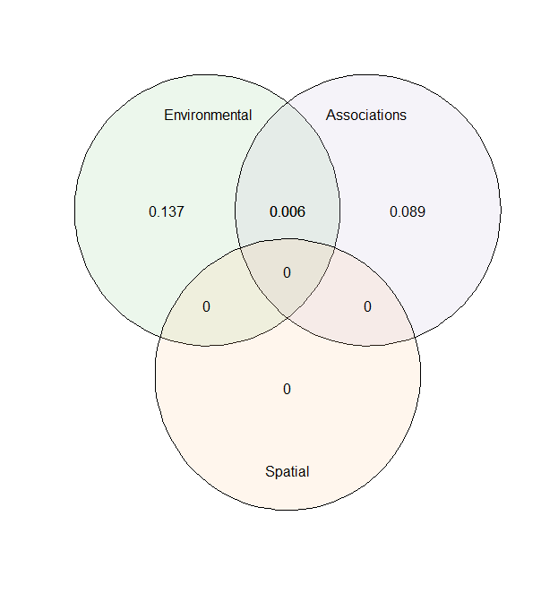

[](http://www.repostatus.org/#active)
[](https://www.gnu.org/licenses/gpl-3.0)


# s-jSDM - Fast and accurate Joint Species Distribution Modeling

## About the method

The method is described in the preprint Pichler & Hartig (2020) A new method for faster and more accurate inference of species associations from novel community data, https://arxiv.org/abs/2003.05331. The code for producing the results in this paper is available under the subfolder publications in this repo.

The method itself is wrapped into an R package, available under subfolder sjSDM. You can also use it stand-alone under Python (see instructions below). Note: for both the R and the python package, python >= 3.6 and pytorch must be installed (more details below).

## Installing the R / Python package

### R-package

Install the package via


```r
devtools::install_github("https://github.com/TheoreticalEcology/s-jSDM", subdir = "sjSDM")
```

Depencies for the package can be installed before or after installing the package. Detailed explanations of the dependencies are provided in vignette("Dependencies", package = "sjSDM"), source code [here](https://github.com/TheoreticalEcology/s-jSDM/blob/master/sjSDM/vignettes/Dependencies.Rmd). Very briefly,  the dependencies can be automatically installed from within R:


```r
sjSDM::install_sjSDM(version = "gpu") # or
sjSDM::install_sjSDM(version = "cpu")
```
Once the dependencies are installed, the following code should run:

Simulate a community and fit model:

```r
library(sjSDM)
community <- simulate_SDM(sites = 400, species = 10, env = 2)
Env <- community$env_weights
Occ <- community$response
SP <- matrix(rnorm(800), 400, 2) # spatial coordinates (no effect on species occurences)

model <- sjSDM(Y = Occ, env = linear(data = Env, formula = ~0+X1:X2 + X1), spatial = linear(data = SP, formula = ~0+X1:X2), se = TRUE)
summary(model)
```

```
## LogLik:  -2343.418 
## Deviance:  4686.836 
## 
## Regularization loss:  0 
## 
## Species-species correlation matrix: 
## 
##         sp1    sp2    sp3    sp4    sp5    sp6    sp7    sp8   sp9 sp10
## sp1   1.000  0.000  0.000  0.000  0.000  0.000  0.000  0.000 0.000    0
## sp2  -0.643  1.000  0.000  0.000  0.000  0.000  0.000  0.000 0.000    0
## sp3   0.704 -0.507  1.000  0.000  0.000  0.000  0.000  0.000 0.000    0
## sp4   0.599  0.137  0.489  1.000  0.000  0.000  0.000  0.000 0.000    0
## sp5   0.327  0.433  0.112  0.768  1.000  0.000  0.000  0.000 0.000    0
## sp6  -0.185  0.526  0.010  0.495  0.133  1.000  0.000  0.000 0.000    0
## sp7  -0.304  0.009  0.155 -0.503 -0.567  0.012  1.000  0.000 0.000    0
## sp8   0.162 -0.528 -0.368 -0.265 -0.356 -0.301 -0.476  1.000 0.000    0
## sp9   0.067 -0.176  0.661  0.234 -0.099  0.233  0.079 -0.372 1.000    0
## sp10 -0.522  0.015 -0.407 -0.377 -0.323 -0.066 -0.356  0.416 0.311    1
## 
## 
## 
## Spatial: 
##              sp1        sp2         sp3         sp4         sp5
## X1:X2 0.04295651 -0.1057641 -0.01993368 0.001198307 -0.03343951
##                sp6       sp7         sp8         sp9        sp10
## X1:X2 -0.009321301 0.1218572 -0.04294305 -0.01796388 -0.08719826
## 
## 
## 
##            Estimate Std.Err Z value Pr(>|z|)    
## sp1 X1       0.5168  0.1106    4.67  3.0e-06 ***
## sp1 X1:X2   -0.3070  0.1925   -1.59  0.11075    
## sp2 X1       0.2606  0.1177    2.21  0.02678 *  
## sp2 X1:X2   -0.0197  0.2055   -0.10  0.92378    
## sp3 X1      -0.9218  0.0987   -9.34  < 2e-16 ***
## sp3 X1:X2    0.1140  0.1706    0.67  0.50379    
## sp4 X1       0.4244  0.1254    3.39  0.00071 ***
## sp4 X1:X2   -0.0733  0.2187   -0.34  0.73736    
## sp5 X1      -0.2174  0.1062   -2.05  0.04065 *  
## sp5 X1:X2   -0.3452  0.1869   -1.85  0.06481 .  
## sp6 X1      -0.7324  0.0993   -7.38  1.6e-13 ***
## sp6 X1:X2    0.1736  0.1724    1.01  0.31390    
## sp7 X1      -0.7707  0.1088   -7.09  1.4e-12 ***
## sp7 X1:X2   -0.0311  0.1905   -0.16  0.87054    
## sp8 X1      -0.5878  0.0942   -6.24  4.5e-10 ***
## sp8 X1:X2    0.0881  0.1601    0.55  0.58213    
## sp9 X1       0.1087  0.0944    1.15  0.24994    
## sp9 X1:X2    0.2143  0.1641    1.31  0.19162    
## sp10 X1     -0.3442  0.1031   -3.34  0.00085 ***
## sp10 X1:X2   0.2659  0.1757    1.51  0.13013    
## ---
## Signif. codes:  0 '***' 0.001 '**' 0.01 '*' 0.05 '.' 0.1 ' ' 1
```
Let's have a look at the importance of the three groups (environment, associations, and space) on the occurences:

```r
imp = importance(model)
print(imp)
```

```
##    sp        env      spatial    biotic
## 1   1 0.12078561 2.551903e-03 0.8766625
## 2   2 0.02725070 1.587115e-02 0.9568781
## 3   3 0.50170450 8.239466e-04 0.4974716
## 4   4 0.04396512 1.220310e-06 0.9560337
## 5   5 0.03753915 1.857366e-03 0.9606035
## 6   6 0.51459398 2.862458e-04 0.4851198
## 7   7 0.33701468 3.012183e-02 0.6328635
## 8   8 0.34215107 6.385192e-03 0.6514637
## 9   9 0.05189434 2.378080e-03 0.9457276
## 10 10 0.11909565 2.159911e-02 0.8593052
```

```r
plot(imp)
```

<!-- -->


As expected, space has no effect on occurences.

Let's have a look on community level how the three groups contribute to the overall explained variance 

```r
an = anova(model, cv = FALSE)
print(an)
```

```
## Changes relative to empty model (without modules):
## 
##  Modules       LogLik            R2   marginal R2
##        _ 2772.5876465  0.000000e+00  0.000000e+00
##        A -136.3852539  1.297179e-02  1.612743e-02
##        B -257.3231494  8.840177e-06  1.285296e-05
##        S   -3.4409180  3.654381e-04  4.576607e-04
##      A+B  -29.0197607 -1.109826e-03 -7.983399e-03
##      A+S   -0.3952637 -2.736718e-05 -4.219040e-05
##      B+S    5.0042627  1.486622e-04 -9.992300e-05
##    A+B+S    5.0356445 -2.809202e-04 -5.562613e-04
##     Full -416.5244385  1.207661e-02  7.916173e-03
```

```r
plot(an)
```

<!-- -->

The anova shows the relative changes in the logLik of the groups and their intersections:

Space has a high positive value which means that space does not increase the model fit.


If it fails, check out the help of ?install_sjSDM, ?installation_help, and vignette("Dependencies", package = "sjSDM"). 

#### Installation workflow:
1. Try install_sjSDM()
2. New session, if no 'PyTorch not found' appears it should work, otherwise see ?installation_help
3. If do not get the pkg to run, create an issue [issue tracker](https://github.com/TheoreticalEcology/s-jSDM/issues) or write an email to maximilian.pichler at ur.de


### Python Package

```bash
pip install sjSDM_py
```
Python example


```python
import sjSDM_py as fa
import numpy as np
Env = np.random.randn(100, 5)
Occ = np.random.binomial(1, 0.5, [100, 10])

model = fa.Model_base(5)
model.add_layer(fa.layers.Layer_dense(10))
model.build(df=5, optimizer=fa.optimizer_adamax(0.1))
model.fit(X = Env, Y = Occ)
print(model.weights_numpy)
print(model.get_cov())
```

